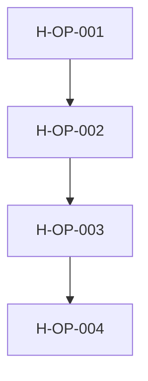
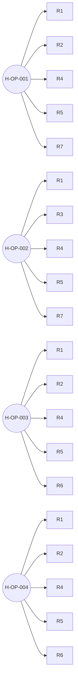
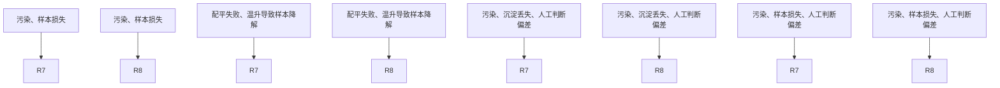
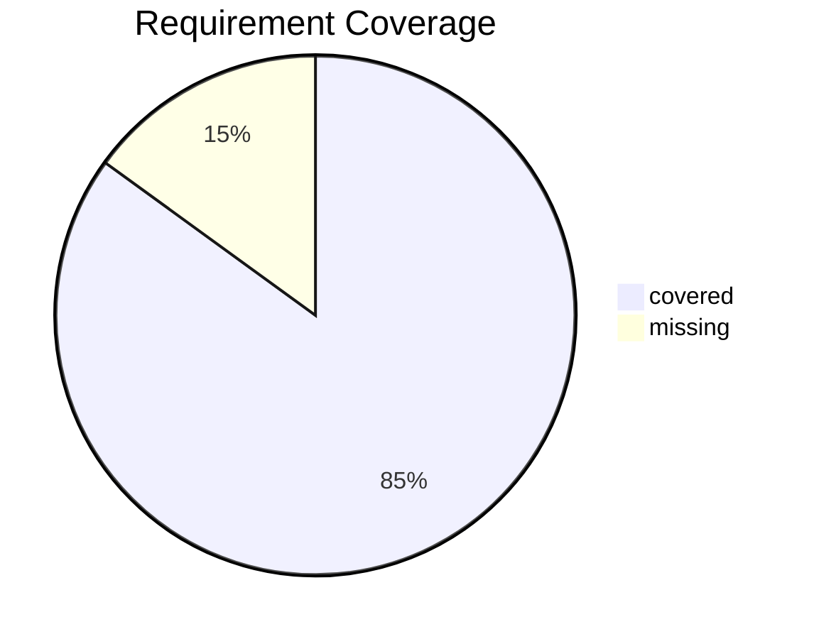

# AutoBiology Requirement Review

Requirements: 34
Clarifications: 1
Coverage rate: 85.0%

## Coverage Matrix

- H-OP-001: R1=covered, R2=covered, R3=missing, R4=covered, R5=covered, R6=missing, R7=covered, R8=covered, R9=covered, R10=covered
- H-OP-002: R1=covered, R2=missing, R3=covered, R4=covered, R5=covered, R6=missing, R7=covered, R8=covered, R9=covered, R10=covered
- H-OP-003: R1=covered, R2=covered, R3=missing, R4=covered, R5=covered, R6=covered, R7=covered, R8=covered, R9=covered, R10=covered
- H-OP-004: R1=covered, R2=covered, R3=missing, R4=covered, R5=covered, R6=covered, R7=covered, R8=covered, R9=covered, R10=covered

## Verification Warnings

- None

## sop-flow.mmd

## hypergraph.mmd

## requirement-trace.mmd

```mermaid
flowchart LR
  H_OP_001[H-OP-001] --> REQ_001[REQ-001 R1]
  H_OP_001[H-OP-001] --> REQ_002[REQ-002 R2]
  H_OP_001[H-OP-001] --> REQ_003[REQ-003 R4]
  H_OP_001[H-OP-001] --> REQ_004[REQ-004 R5]
  H_OP_001[H-OP-001] --> REQ_005[REQ-005 R7]
  H_OP_001[H-OP-001] --> REQ_006[REQ-006 R8]
  H_OP_001[H-OP-001] --> REQ_007[REQ-007 R9]
  H_OP_001[H-OP-001] --> REQ_008[REQ-008 R10]
  H_OP_002[H-OP-002] --> REQ_009[REQ-009 R1]
  H_OP_002[H-OP-002] --> REQ_010[REQ-010 R3]
  H_OP_002[H-OP-002] --> REQ_011[REQ-011 R4]
  H_OP_002[H-OP-002] --> REQ_012[REQ-012 R5]
  H_OP_002[H-OP-002] --> REQ_013[REQ-013 R7]
  H_OP_002[H-OP-002] --> REQ_014[REQ-014 R8]
  H_OP_002[H-OP-002] --> REQ_015[REQ-015 R9]
  H_OP_002[H-OP-002] --> REQ_016[REQ-016 R10]
  H_OP_003[H-OP-003] --> REQ_017[REQ-017 R1]
  H_OP_003[H-OP-003] --> REQ_018[REQ-018 R2]
  H_OP_003[H-OP-003] --> REQ_019[REQ-019 R4]
  H_OP_003[H-OP-003] --> REQ_020[REQ-020 R5]
  H_OP_003[H-OP-003] --> REQ_021[REQ-021 R6]
  H_OP_003[H-OP-003] --> REQ_022[REQ-022 R7]
  H_OP_003[H-OP-003] --> REQ_023[REQ-023 R8]
  H_OP_003[H-OP-003] --> REQ_024[REQ-024 R9]
  H_OP_003[H-OP-003] --> REQ_025[REQ-025 R10]
  H_OP_004[H-OP-004] --> REQ_026[REQ-026 R1]
  H_OP_004[H-OP-004] --> REQ_027[REQ-027 R2]
  H_OP_004[H-OP-004] --> REQ_028[REQ-028 R4]
  H_OP_004[H-OP-004] --> REQ_029[REQ-029 R5]
  H_OP_004[H-OP-004] --> REQ_030[REQ-030 R6]
  H_OP_004[H-OP-004] --> REQ_031[REQ-031 R7]
  H_OP_004[H-OP-004] --> REQ_032[REQ-032 R8]
  H_OP_004[H-OP-004] --> REQ_033[REQ-033 R9]
  H_OP_004[H-OP-004] --> REQ_034[REQ-034 R10]
```

## risk-network.mmd

## coverage-matrix.mmd

